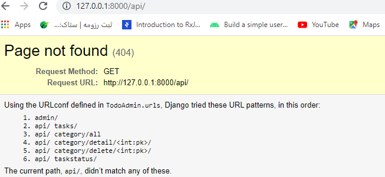
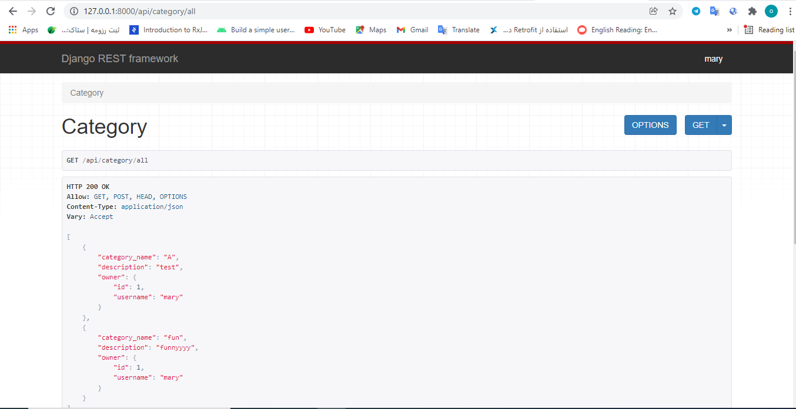
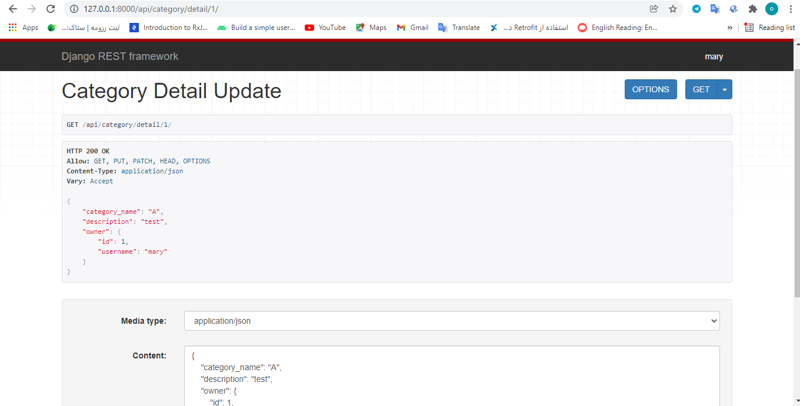
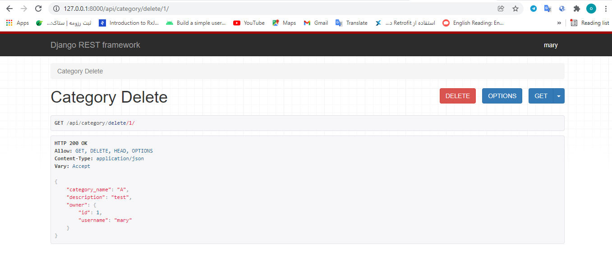
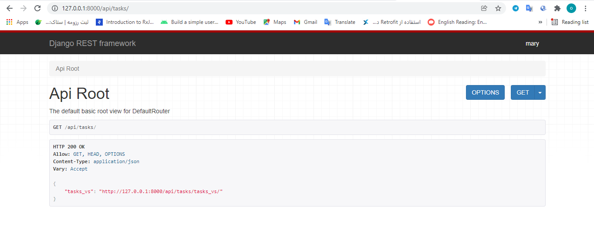
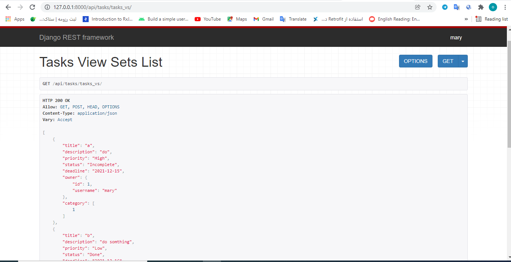
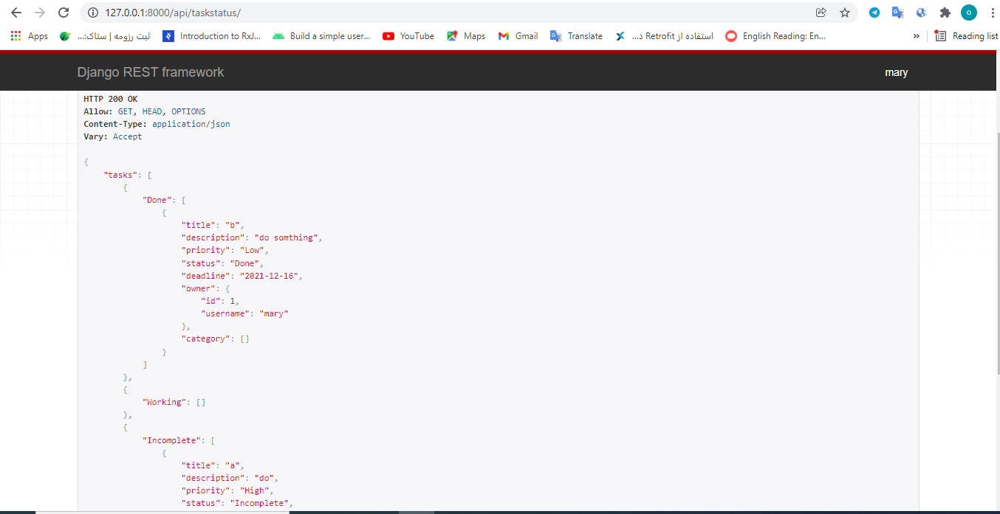

# ReminderWithRestApi
* TODO LIST with django rest framework
## :page_facing_up: Table of contents
* [:books: General info](#books-general-info)
 * [:camera: Screenshots](#camera-Screenshots)
  * [:floppy_disk: Setup](#floppy_disk-setup)
## :books: General info
* this is TODO List project that is used django Rest framework . the user  can : add tasks and category, delete task , update task and category , see tasks and category . super user can delete category.
* this project using viewsets and generic view  and apiview .
## :camera: Screenshots

## :floppy_disk: Setup
* [Install Python](https://docs.python-guide.org/starting/installation/)
* [Install Django](https://docs.djangoproject.com/en/3.1/howto/windows/) by typing `pip install Django`
* [Install DjangoRestFramework](https://www.django-rest-framework.org/#quickstart/) by typing `pip install djangorestframework `
* open project
* Run `python manage.py makemigrations` for changes to models etc.
* Run `python manage.py migrate` to migrate the migration files.
* To add a superuser run `python manage.py createsuperuser
* Run `python manage.py runserver` to run server on port 8000

